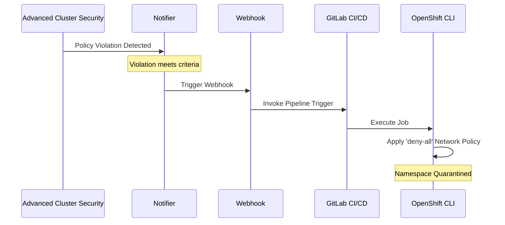

# OpenShift Network Policy Automation with ACS and GitLab CI/CD

This repo contains the configuration and scripts used to automate the application of network policies in an OpenShift cluster. The automation is triggered by policy violations detected by Red Hat Advanced Cluster Security (ACS) and executed through a GitLab CI/CD pipeline.

The key components of this setup include:
- **ACS Policy Violation Detection**: ACS monitors the OpenShift cluster for specific policy violations.
- **GitLab CI/CD Pipeline**: Triggered by ACS when a policy violation occurs, executing an Ansible playbook to apply a predefined network policy to the implicated namespace in OpenShift.
- **Ansible Playbook**: Automates the extraction of the namespace from the ACS alert and applies a `deny-all` network policy to isolate the implicated namespace in OpenShift.

## Documentation

- [Setting Up GitLab Project Triggers](./docs/README-GitLab-Project-Triggers.md): Detailed instructions on setting up GitLab project triggers for automated pipeline execution.
- [Creating ACS Generic Webhook Integration](./docs/README-ACS-Webhook-Integration.md): Guide on configuring ACS to trigger external services using generic webhooks.
- [Applying ACS Webhook Notifier to Existing Policies](./docs/README-ACS-Webhook-Notifier-Policies.md): Steps to apply a generic webhook notifier to existing ACS policies.
- [Samples](./samples/readme.md): _bad pod_ deployment sample use case

## Components

### ACS Webhook Configuration

ACS is configured to send a webhook to the GitLab CI/CD pipeline trigger URL when a specific policy violation occurs. The webhook payload includes details of the policy violation, such as the affected namespace.

### GitLab CI/CD Pipeline

The `.gitlab-ci.yml` file in this repository defines the pipeline configuration. The pipeline has a single job that is triggered by the ACS webhook. This job executes an Ansible playbook to apply the network policy in OpenShift.

### Ansible Playbook

The Ansible playbook (`main.yml`) is the core of the automation. It performs the following actions:
- Parses the namespace and other relevant information from the ACS webhook payload.
- Uses Jinja2 templating to dynamically create a network policy YAML file targeting the namespace identified in the ACS alert.
- Applies the network policy to the OpenShift cluster using the `k8s` Ansible module.

### Network Policy Template

The playbook uses a Jinja2 template (`deny-all-network-policy.yaml.j2`) for the Kubernetes network policy. This template defines a policy that denies all ingress and egress traffic in a specific namespace. The playbook dynamically updates this file to target the namespace identified in the ACS alert.

## Usage

### Triggering the Pipeline

The pipeline is automatically triggered by ACS when a policy violation that meets the defined criteria occurs. The violation details are sent to GitLab, which then executes the Ansible playbook.

